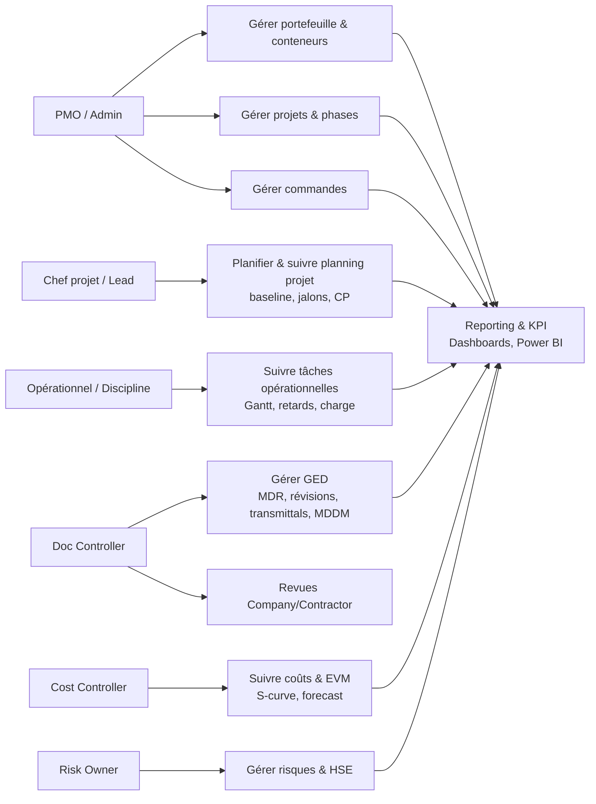
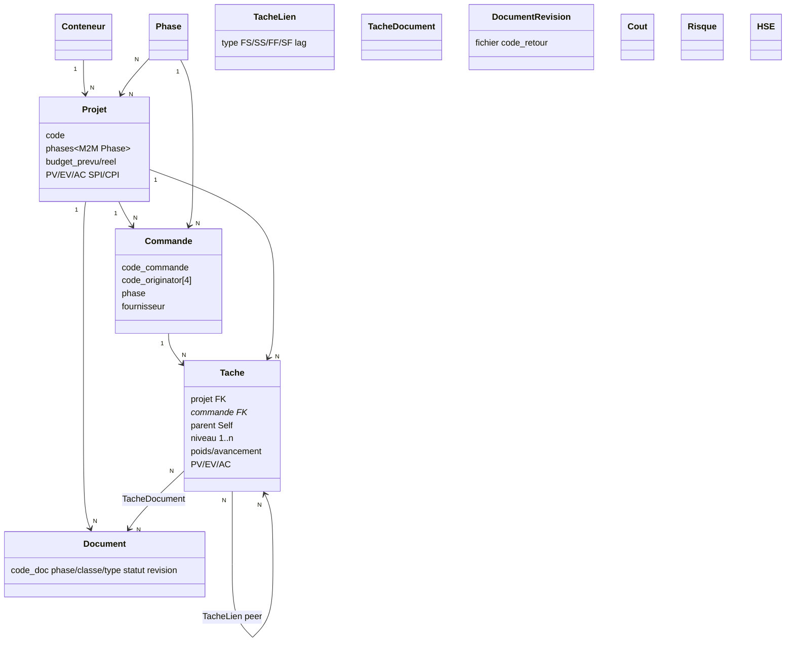
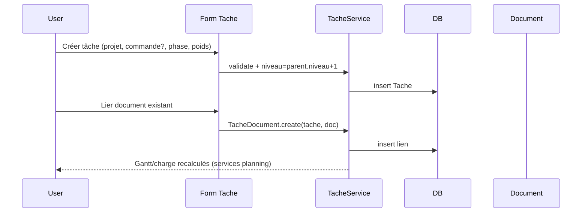
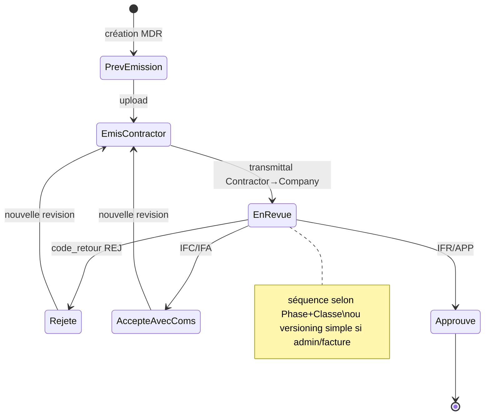
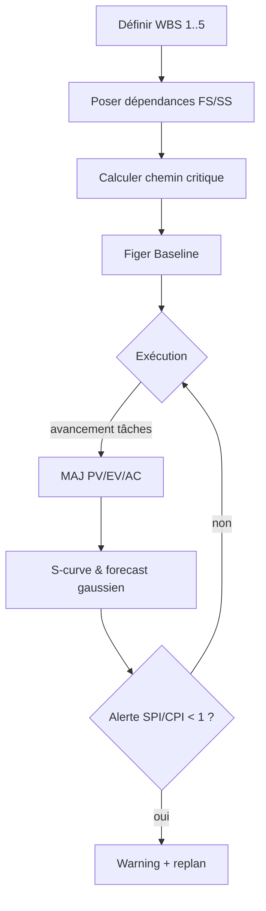

# PMO EPC Platform

# Data Model

Version : 0.1

---

# Objectif

Ce document décrit l'ensemble du modèle métier de PMO EPC Platform.

Il constitue la référence unique pour :

- les modèles Django
- les services
- les API
- les écrans
- les tableaux de bord
- les calculs métier

Toutes les nouvelles fonctionnalités doivent respecter ce modèle.

---

# Hiérarchie métier

La hiérarchie fonctionnelle principale est la suivante.

```
Conteneur documentaire
        │
        ▼
     Projet
        │
        ▼
    Commande
        │
        ▼
      Tâche
```

Autour de cette hiérarchie viennent se rattacher :

```
Projet

├── Commandes
├── Documents
├── Planning
├── Coûts
├── Risques
├── Reporting
├── Handover
├── KPI
└── EVM
```

---

# Objet : Projet

Le Projet constitue l'objet central de la plateforme.

Il représente un contrat global, un chantier ou une opération.

## Relations

Projet

├── 1..N Commandes

├── 1..N Documents

├── 1..N Tâches

├── 1..N Risques

├── 1..N Coûts

├── 1..N Planning

└── 1 Dashboard

---

## Principaux attributs

Code

Nom

Description

Client

Entité

Pays

Site

Responsable

Priorité

Statut

Dates prévues

Dates réelles

Budget

Avancement

SPI

CPI

PV

EV

AC

---

# Objet : Commande

Une commande représente :

- Contract
- Purchase Order
- Package
- Lot
- Marché

Une commande appartient toujours à un projet.

---

Relations

Commande

├── 1 Projet

├── N Documents

├── N Tâches

├── N Coûts

├── N Jalons

└── N Plannings

---

Principaux attributs

Code

Titre

Type

Fournisseur

Montant

Devise

Responsable

Dates

Statut

Progression

---

# Objet : Tâche

La tâche constitue l'unité élémentaire d'exécution.

---

Relations

Tâche

├── 1 Projet

├── 0..1 Commande

├── 0..N Documents

├── 0..N Dépendances

├── 0..N Ressources

├── 0..N Jalons

└── 0..N Activités Planning

---

Attributs principaux

Nom

Description

Discipline

Phase

Responsable

Priorité

Statut

Poids

Avancement

Durée

Dates prévues

Dates réelles

Coût prévu

Coût réel

PV

EV

AC

---

# Objet : Document

Le document représente un livrable.

---

Relations

Document

├── Projet

├── Commande

├── Discipline

├── Phase

├── Révisions

├── Transmittals

├── Workflow

└── Tâches

---

Attributs

Numéro

Titre

Révision

Statut

Poids documentaire

Date émission

Date retour

Date approbation

Responsable

---

# Objet : Planning

Le projet possède deux notions de planning.

---

## Suivi des tâches

Aucun modèle dédié.

Les informations proviennent exclusivement des tâches.

Calculs :

Gantt

Calendrier

Retards

Charge

Jalons

Statistiques

---

## Planning Project

Modèle indépendant.

Planning

├── Activités

├── Baselines

├── Versions

├── Dépendances

├── Ressources

├── Calendriers

├── Contraintes

└── Jalons

---

# Objet : Ressource

Une ressource peut représenter :

Personne

Equipe

Entreprise

Machine

Matériel

---

Relations

Ressource

├── N Activités Planning

├── N Tâches

└── Calendrier

---

# Objet : Calendrier

Décrit les jours travaillés.

---

Contient :

Jours ouvrés

Week-end

Jours fériés

Congés

Horaires

Exceptions

---

# Objet : Baseline

Une baseline représente une photographie d'un planning.

---

Contient

Dates

Durées

Chemin critique

Ressources

Coûts

---

# Objet : Version

Chaque modification importante crée une version.

Version

1

1.1

1.2

2.0

...

Une version peut devenir une baseline.

---

# Objet : Dépendance

Une dépendance relie deux activités.

Types

FS

SS

FF

SF

Lag

Lead

---

# Objet : Jalon

Un jalon représente une date clé.

Peut être :

Projet

Commande

Planning

Documentaire

Technique

Contractuel

---

# Objet : Coût

Relations

Projet

Commande

Tâche

---

Valeurs

Budget

Engagé

Réel

Prévision

Ecart

---

# Objet : Risque

Relations

Projet

Commande

---

Attributs

Probabilité

Impact

Criticité

Réponse

Responsable

---

# Objet : Handover

Le handover représente un ensemble documentaire livré.

Exemples

As Built

Maintenance

Inspection

Commissioning

Archives

---

Relations

Projet

Documents

Lots

Workflow

---

# Objet : Reporting

Le reporting n'a pas de données propres.

Il agrège les données des autres modules.

---

# Objet : Dashboard

Le Dashboard agrège :

Planning

Coûts

Documents

Risques

EVM

KPI

---

# Objet : EVM

Calculé à partir :

Projet

Commande

Tâche

Indicateurs

PV

EV

AC

BAC

EAC

ETC

VAC

SPI

CPI

TCPI

---

# Référentiels

Les objets suivants sont utilisés par plusieurs modules.

Pays

Site

Entité

Discipline

Phase

Client

Fournisseur

Statut

Priorité

Type documentaire

Type de contrat

Type de risque

Type de coût

Calendrier

Ressource

Tous ces objets doivent être gérés dans le module Référentiels.

---

# Relations globales

```
Projet
│
├── Commandes
│      │
│      ├── Documents
│      ├── Tâches
│      ├── Coûts
│      ├── Planning
│      ├── Jalons
│      └── Risques
│
├── Documents
│
├── Tâches
│
├── Planning Project
│
├── Coûts
│
├── Risques
│
├── Reporting
│
├── EVM
│
└── Handover
```

---

# Principes de modélisation

Chaque objet doit respecter les règles suivantes :

• Un modèle = un concept métier.

• Les calculs ne sont jamais stockés lorsqu'ils peuvent être recalculés.

• Les référentiels sont mutualisés.

• Les relations ManyToMany utilisent une table intermédiaire lorsqu'elles portent des informations métier.

• Les suppressions physiques sont évitées au profit d'un archivage logique lorsque pertinent.

• Les services manipulent les objets ; les vues ne contiennent pas de logique métier.

---

# Vision à long terme

Le modèle est conçu pour couvrir l'ensemble du cycle de vie d'un projet EPC :

```
Opportunité
      │
      ▼
Concept
      │
      ▼
FEED
      │
      ▼
Engineering
      │
      ▼
Procurement
      │
      ▼
Fabrication
      │
      ▼
Construction
      │
      ▼
Commissioning
      │
      ▼
Handover
      │
      ▼
Exploitation
      │
      ▼
Archivage
```

L'ensemble des modules de PMO EPC Platform doit rester cohérent avec ce modèle métier unique.# Cadrage PMO EPC Platform — V2 (07/08/2026)

> Refonte du cadrage à ce stade, après lecture de tous les `.md`, des 3 `.docx` et du code `backend/apps/*`. Remplace/complète `01. GUIDE_ARCHITECTURE`, `03. FUNCTIONAL_SPEC`, `04. DATA_MODEL` (vide) et `05. SPEC_UML`.

---

## 1. Vision Project Control

L'outil n'est **pas** un clone de Primavera/MS Project/Aconex. C'est une **plateforme Project Control** qui fédère :

- **Délais** : planning opérationnel vs planning projet (baseline), S-curves, EVM (PV/EV/AC, SPI/CPI, EAC/ETC/VAC), forcasts gaussiens, jalons, chemin critique, retards, charge, WBS 1..n
- **Coûts** : budget prévu/réel/engagé, cost breakdown par phase/commande, EAC, cash-flow
- **Exécution** : avancement pondéré (poids), RACI, HSE (à créer : incidents, audits, toolbox, KPI TRIR/LTIR), qualité
- **GED** : référentiel documentaire unique, tous conteneurs (projets ENG, maintenance, inspection, administratif/factures), cycle de vie *ou* simple versioning selon conteneur/classe, MDR, révisions, transmittals, MDDM, revue Company/Contractor
- **Risques** : matrice, heatmap, criticité, plans d'action
- **KPI & Reporting** : KPI transverses par module, dashboards portefeuille/projet/commande, exports, Power BI

Chaque module expose ses **KPI exhaustifs** ; le dashboard assemble.

---

## 2. Socle hiérarchique

```
Conteneur (cycle de vie : RUNNING, COM, ASBUILT, ARCHIVE... administrable)
  └─ Projet (code, entités/sites M2M, conteneur, statut, priorité, dates, budget, EVM)
       ├─ Phases (dynamiques, via core_ref.Phase — EPC, EPCC, Commissioning, etc.)
       │    └─ matérialisées par les Commandes (1 commande = 1 phase + 1 fournisseur)
       ├─ Commande (code_commande, code_originator 4 chars convention, phase, fournisseur/entite_contractor)
       ├─ Tâche (unité d'exécution)
       ├─ Document (GED central, rattaché Projet/Commande, ou générique)
       ├─ Coût / Risque / HSE
       └─ Planning (2 vues, voir §3)
```

- **Projet.phases** : à l'avenir *dérivé* des `Commande.phase` distinctes **ou** M2M explicite `Projet.phases` pour afficher un projet sans commande encore. Recommandation : **rester flexible — dériver par défaut, M2M si besoin explicite** (projet sans commande mais avec phases prévues).
- **Commande** : `1 projet + 1 phase + 1 fournisseur` — souple sur `code_originator` (4 chars = convention, pas contrainte bloquante).
- **Tâche — avis** : voir §3.

### Conteneurs documentaires

| Conteneur | Cycle de vie | Versioning | Exemple |
|---|---|---|---|
| Projets ENG/EPC | Oui (séquence statuts par phase/classe) | Oui | P&ID, plans, specs |
| Maintenance/Inspection | Partiel | Oui | rapports, fiches |
| Administratif | Non | Oui seul | factures, contrats |

→ `StatutCycleVie` + `SequenceStatut` ne s'appliquent que si `ClasseDocumentaire.avec_cycle=True`.

---

## 3. Décision : flexibilité des Tâches — mon avis

**Question** : `Tache.projet` obligatoire (FK) + `commande` optionnelle vs `M2M projets` + `M2M commandes` ?

**Ma recommandation : GARDER LE FK SIMPLE aujourd'hui, prévoir l'extension sans la faire maintenant.**

| Option | Avantages | Inconvénients |
|---|---|---|
| **A. FK simple (actuel)** : `projet FK required` + `commande FK nullable` → générique si besoin | Simple, performant, EVM agrégable sans ambiguïté (1 tâche = 1 projet), FK = 1 baseline claire, Primavera-like | Tâche transversale = 2 tâches liées (peer link) |
| **B. Full M2M** : `projets M2M` + `commandes M2M` | Flexibilité max, 1 tâche partagée | EVM double compte, agrégation incertaine, UI/filtres complexes, chemin critique ambigu, migrations lourdes |
| **C. Hybride recommandé (évolutif)** | FK `projet` principal (obligatoire, tombe sur générique si orpheline) + FK `commande` principale (nullable) + M2M `projets_lies`/`commandes_liees` optionnels + `TacheLien` peer (même niveau) + `TacheDocument` M2M | Flexibilité sans complexité initiale : le M2M ne sert que pour cas transversal, le FK reste la vérité EVM |

**→ Je propose C en cible, mais implémenter seulement en Phase 1 : `parent` + `niveau` + `TacheLien` (peer FS/SS/FF/SF) + `TacheDocument` M2M, et laisser les M2M projets/commandes pour Phase 2 si un cas réel l'exige.** Avantage : on ne casse pas l'existant, on garde les perfs, et on reste compatible avec ta demande `0..N` via `Projet/Commande génériques`.

---

## 4. Deux plannings — clarifié

- **`apps.planning` (opérationnel)** : *sans modèle*, services sur `Tache` (Gantt, calendrier, jalons, retards, charge, `par_projet/commande/responsable`). Affiche **toutes** les tâches.
- **`apps.planning_project` (moteur)** : *avec modèles* (`Baseline`, `Version`, `Dependance`, `Ressource`, `Calendrier`, `Contrainte`, chemin critique, nivellement, export). Ne remonte que **niveaux 1..5** ; 6..n restent opérationnelles.

Hiérarchie à ajouter : `Tache.parent (Self FK)`, `Tache.niveau (int, calculé)`, `TacheLien(type FS/SS/FF/SF, lag)`.

---

## 5. GED central

`Document` est le **référentiel unique** (projet/commande ou générique). Les autres modules ne stockent que des **liens** (`TacheDocument`, `CommandeDocument`, etc.). Cycle de vie par `Phase + ClasseDocumentaire` ; `MDR` = vue filtrée par commande ; `Revision` = fichier + `code_retour`.

---

## 6. KPI cibles (extrait)

- **Délais** : % avancement pondéré, SPI, retards cumulés, jalons à date, charge vs capacité
- **Coûts** : CPI, EAC/ETC/VAC, écart prévu/réel, cash-flow S-curve
- **Docs** : deltas `date_prévue vs réelle`, `statut_attendu vs actuel`, taux `IFR/IFA`, performance revue Company (jours), updates Contractor, retards contractuels
- **Risques** : exposition, criticité, plans soldés
- **HSE** : TRIR, LTIR, incidents ouverts/clos, audits, toolbox — *module à créer*

---

## 7. Diagrammes Mermaid (à copier dans Mermaid Live / PlantUML)

### 7.1 Use Case global



### 7.2 Classes (simplifié)



### 7.3 Séquence — création tâche + liaison doc



### 7.4 État — Document



### 7.5 Activité — Planning projet (baseline)



---

## 8. Feuille de route MAJ

- **Phase 0** ✅ fait (env, deps, urls, cleanup)
- **Phase 1** → `Projet.phases` (optionnel), `Tache.parent/niveau` + `TacheLien` + `TacheDocument`, contraintes, filtre niveau 1..5
- **Phase 2** → `planning_project` modèles Baseline/Version/Dépendance/Ressource/Calendrier, HSE, Cost EAC, Risk matrix
- **Phase 3** → KPI exhaustifs, S-curves, forecast, RACI, Docker/VPS

---

## 9. Fichiers à mettre à jour

- `00-CAHIER DES CHARGES/contexte/04. PMO_EPC_DATA_MODEL.md` → réécrire (était vide) avec ce cadrage + diagrammes classe
- `05. SPEC_UML_TEXTUELLE.md` → enrichir avec use case/séquence/état/activité ci-dessus
- `docs/ARCHITECTURE_GED_PLANNING.md` → compléter avec conteneurs + RACI/HSE
- `03. FUNCTIONAL_SPEC` → ajouter KPI HSE/docs

Tu veux que je pousse ces MAJ de `.md` directement sur `arena/019fda3f-pmo-epc` ?
