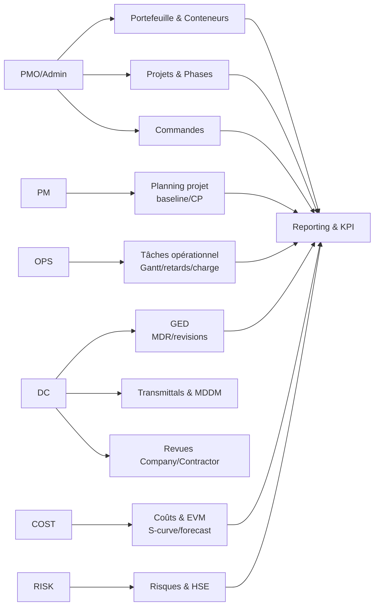
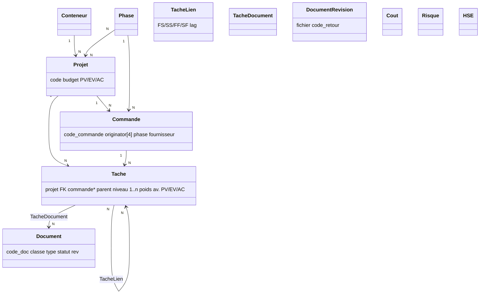
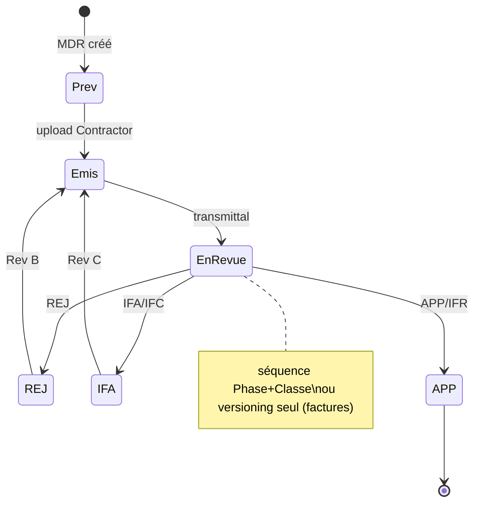
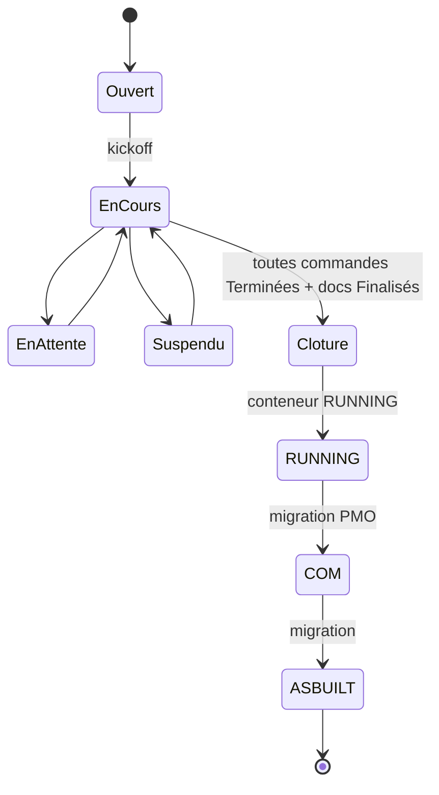
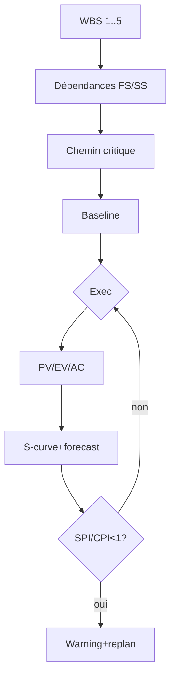
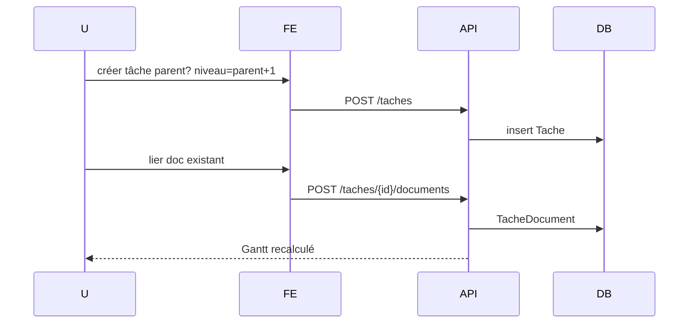
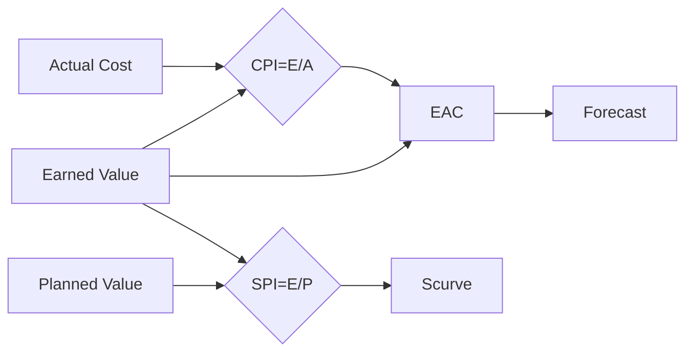

# Refonte PMO EPC — Vue d'ensemble (V3 — 07/08/2026)

> Synthèse pour refondre l'actuel `pmo_epc` (Django/Postgres) en **deux cibles** :
> - **pmo_epc1** : PHP 8.2 / Laravel 12 / MySQL 8.4 / Bootstrap 5 — **déployable OVH mutualisé Pro**
> - **pmo_epc2** : Stack native Arena avec **prévisualisation live** — Django 5.1 + Next.js 15 + Tailwind + Postgres — **VPS/PaaS**

---

## 1. Pourquoi deux cibles ?

| Critère | pmo_epc1 (Laravel) | pmo_epc2 (Arena) |
|---|---|---|
| Hébergement | OVH mutualisé Pro (PHP only, pas de Python) → coût mini | VPS OVH / PaaS (Fly/Render) → Python OK, preview live |
| Prévisualisation | Blade/Livewire, preview simple | Next.js + API Django, hot reload + preview Arena intégrée |
| Équipe | PHP/Laravel largement connu chez GED | Python/Django déjà initié, plus riche pour EVM/IA |
| Base | MySQL 8.4 (mutualisé) | PostgreSQL (moteur EVM, JSONB, CTE WBS) |
| UI | Bootstrap 5 + Livewire 3 + Alpine | Tailwind + shadcn + React Query |

**Les deux partagent le même modèle métier (Phase 1 validée : `Tache.parent/niveau` + `TacheLien` + `TacheDocument`)** — seule l'implémentation change.

---

## 2. Périmètre fonctionnel commun (Project Control)

- Portefeuille par **Conteneur** (RUNNING/COM/ASBUILT/ARCHIVE administrable) + migration tracée
- **Projet** (phases dynamiques via `Phase`), **Commande** (1 phase + 1 fournisseur + originator 4 chars), **Tâche** WBS `1..n` (1..5 → planning projet, 6..n opérationnel seul) avec `parent` + `TacheLien` peer `FS/SS/FF/SF`
- **GED central** multi-conteneurs (cycle vie *ou* versioning seul) : `Document`/`Revision`, MDR par commande, `TacheDocument` M2M, transmittals, MDDM, revues
- **Planning** : opérationnel (Gantt/calendrier/retards/charge) vs moteur planning projet (baseline/version/dépendances/ressources/calendriers/chemin critique)
- **Coûts/EVM** : PV/EV/AC, SPI/CPI, EAC/ETC/VAC, S-curves + forecast gaussien, cash-flow
- **Risques/HSE** : matrice, heatmap, TRIR/LTIR
- **KPI + Reporting** : exhaustifs par module + RACI

Voir `docs/pmo_epc1/CAHIER_CHARGES_FONCTIONNEL.md` (détails) et Mermaid ci-dessous.

---

## 3. Mermaid — Référence unique (valable pmo_epc1 + pmo_epc2)

### 3.1 Use Cases

### 3.2 Classes (domaine)

### 3.3 États Document

### 3.4 États Projet/Conteneur

### 3.5 Activité Baseline

### 3.6 Séquence tâche+doc

### 3.7 Flux EVM

---

## 4. Cahiers livrés

- `docs/pmo_epc1/CAHIER_CHARGES_FONCTIONNEL.md` — fonctionnel exhaustif
- `docs/pmo_epc1/CAHIER_CHARGES_TECHNIQUE.md` — technique Laravel/MySQL
- `docs/pmo_epc2/CAHIER_CHARGES_FONCTIONNEL.md` — idem (même périmètre, adaptations preview)
- `docs/pmo_epc2/CAHIER_CHARGES_TECHNIQUE.md` — technique Django+Next/Postgres

Voir ces 4 fichiers pour le détail par module, flux, KPI, schémas.
