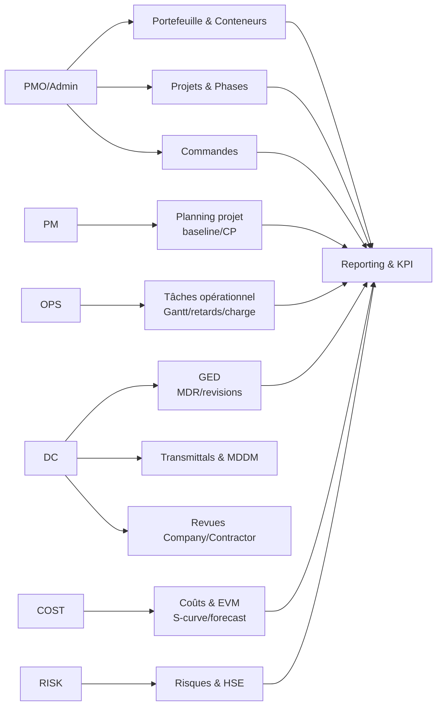
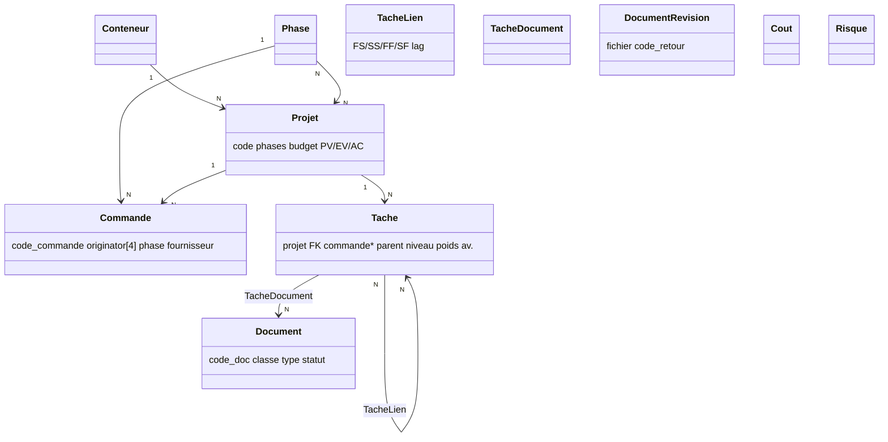
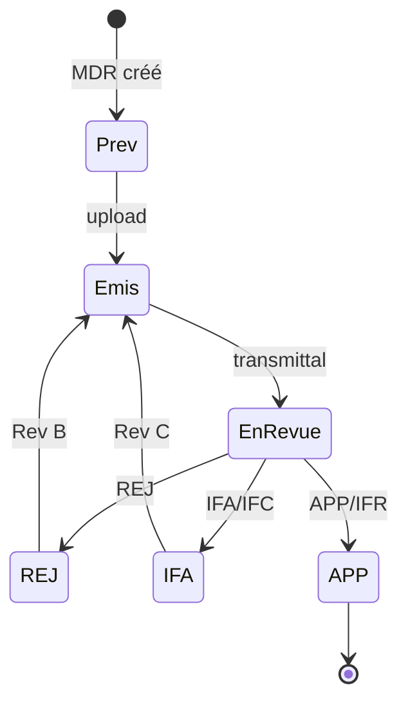
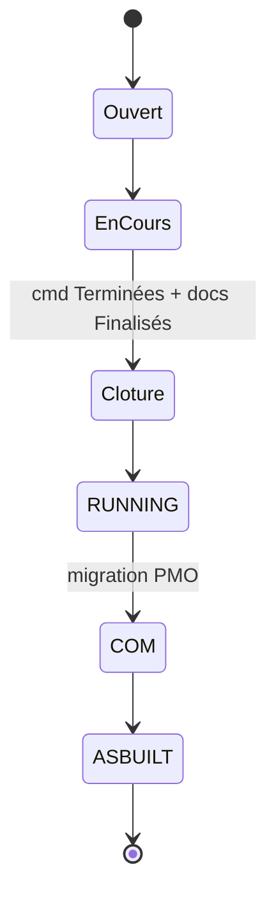
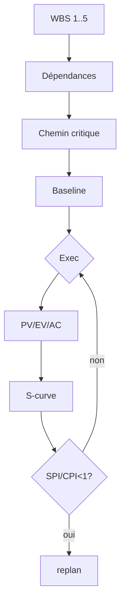
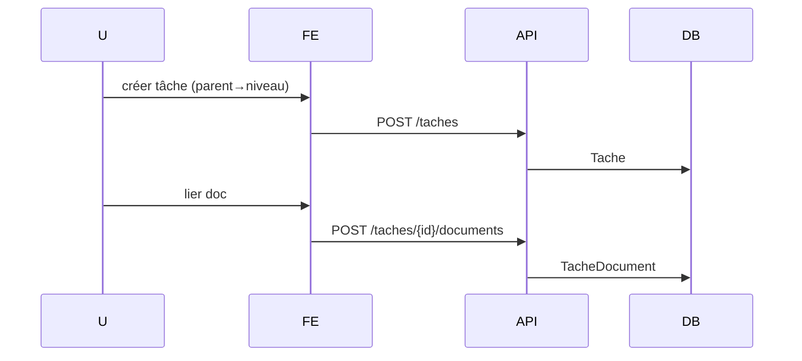
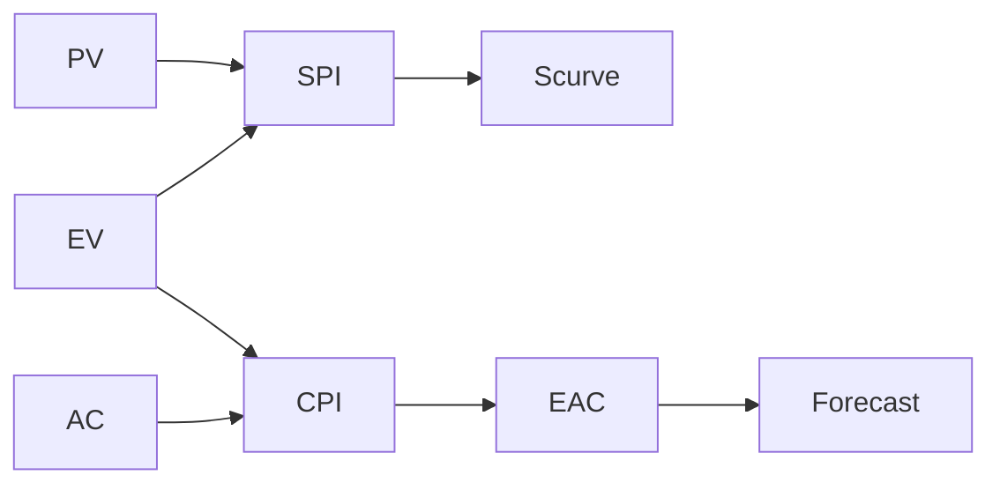

# Refonte PMO EPC — Vue d'ensemble (V3 — 07/08/2026)

> Actuel `pmo_epc` (Django/Postgres) → **3 cibles** :
> - **pmo_epc1** : PHP 8.2 / Laravel 12 / MySQL 8.4 / Bootstrap 5 — **OVH mutualisé Pro**
> - **pmo_epc2** : Django 5.1 + Next.js 15 + Tailwind + Postgres — **VPS/PaaS, preview Arena via proxy**
> - **pmo_epc3** : Next.js 15 / TypeScript / Prisma / SQLite→Postgres / Tailwind — **100% visualisable ici** (`npm run dev`)

---

## Stacks comparées

| Critère | pmo_epc1 (Laravel) | pmo_epc2 (Django+Next) | **pmo_epc3 (Next fullstack) ⭐ visualisable** |
|---|---|---|---|
| Hébergement | OVH mutualisé (PHP only) | VPS/PaaS | Vercel / VPS / **Arena preview** |
| Preview | Blade | Next proxie Django | **Direct `next dev -H 0.0.0.0`** |
| DB | MySQL 8.4 | Postgres | SQLite dev → Postgres prod |
| Lancement | `php artisan serve` | `django + next` 2 serveurs | `npm run dev` 1 serveur |

Modèle métier identique (Phase 1 : `Tache.parent/niveau` + `TacheLien` + `TacheDocument`).

---

## Mermaid — Référence unique (3 cibles)

### Use Cases

### Classes

### États Document

### États Projet/Conteneur

### Activité Baseline

### Séquence & Flux EVM

---

## Livrables

- `docs/pmo_epc1/*` — pmo_epc1
- `docs/pmo_epc2/*` — pmo_epc2
- `docs/pmo_epc3/*` — pmo_epc3 (preview)
- `pmo_epc3/` — squelette Next exécutable (`npm run dev`)
