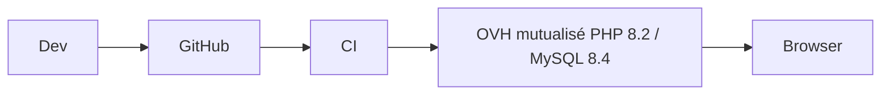

# pmo_epc1 — Cahier des Charges Technique (Laravel 12 / MySQL 8.4)

---

## 1. Stack

PHP 8.2, Laravel 12, MySQL 8.4 (InnoDB, `utf8mb4_unicode_ci`), Bootstrap 5.3 + Bootstrap Icons + Livewire 3 + Alpine.js, Spatie Permission, Laravel Excel, DomPDF, Intervention Image. Node 20 (Vite) pour assets. Compatible **OVH mutualisé Pro** (pas de daemon).

## 2. Architecture

```
app/
  Models/ (Projet, Commande, Tache, TacheLien, TacheDocument, Document, DocumentRevision, Conteneur, Phase...)
  Http/Controllers/ (Resource + Services)
  Services/ (PlanningService, GanttService, EvmService, GedService)
  Policies/ + Observers/
resources/views/
  layouts/{list,form,workspace_detail,delete}
  components/{badges,cards,detail,forms,states,tables,widgets,plannings}
```

Controllers fins → Services métier → Repositories/Eloquent. Composants Blade réutilisables.

## 3. Modèle DB (MySQL)

- `conteneurs`, `pays`, `sites(id,pays_id)`, `secteurs(site_id)`, `phases`, `disciplines`, `originators`, `classe_documentaires(avec_cycle)`, `doc_types_techniques`, `statut_cycle_vies`, `sequence_statuts`
- `projets`, `projet_entite`, `projet_site`, `migration_conteneur_logs`, `projet_curve_points(projet_id,date,granularite,planned/earned/actual/forecast)`, `forecast_rules(projet_id unique)`
- `commandes(projet_id FK CASCADE, phase_id, entite_contractor_id, code_commande unique, code_originator CHAR 4 CHECK regex)`
- `taches(projet_id CASCADE, commande_id SET NULL, parent_id FK taches CASCADE, niveau TINYINT CHECK >=1, phase/discipline/responsable, poids/avancement DECIMAL 5,2 CHECK 0..100, dates, couts, EVM, est_en_retard/jalon, timestamps, indexes projet/commande/parent/niveau)`
- `tache_liens(tache_source_id, tache_cible_id, type_lien ENUM FS/SS/FF/SF, decalage_jours, unique source/cible/type, check source<>cible)`
- `tache_documents(tache_id, document_id, role, unique)`
- `documents`, `document_revisions(document_id, fichier VARCHAR, statut_id, code_retour)`, `historique_taches`

Collations `utf8mb4`, FK `ON DELETE CASCADE/SET NULL`, indexes sur `projet_id, responsable_id, statut`.

## 4. Auth & ACL

Laravel Breeze/Jetstream, `users(entite_id, role ENUM)`, Spatie Permission (roles + perms), Policies par modèle (PMO vs Contractor), `conteneur.lecture_seule` middleware.

## 5. GED

Storage `storage/app/documents/{Y}/{m}`, `code_documentaire` unique généré (`PAYS-SITE-SECTEUR-ORIG-DISC-TYPE-SEQ`), `StatutCycleVie` dynamique par `Phase+Classe` (si `avec_cycle=false` → versioning seul).

## 6. Planning & EVM

Services : `GanttService` (CTE récursive MySQL 8 `WITH RECURSIVE` pour WBS), `ChargeService`, `JalonsService`, `RetardsService`. EVM : `recalculer_progression()` via `SUM(avancement*poids)/SUM(poids)` (Eloquent `selectRaw`). S-curve Chart.js.

## 7. API & Services

REST JSON `/api/v1/...` (Laravel Sanctum), mêmes Services que vues — prêts pour Power BI / Next.js.

## 8. Qualité

PHPStan, Pint, Pest, CI GitHub Actions (pint, phpstan, pest, vite build), `php artisan migrate --force`, `storage:link`.

## 9. Déploiement OVH

- Mutualisé : `composer install --no-dev`, `npm run build`, `php artisan config:cache`, `migrate`, `STORAGE` via FTP, `APP_KEY` en `.env`, `QUEUE_CONNECTION=database` (pas de horizon).
- Alternative VPS : Horizon + MySQL 8.4.

## 10. Diagramme déploiement


