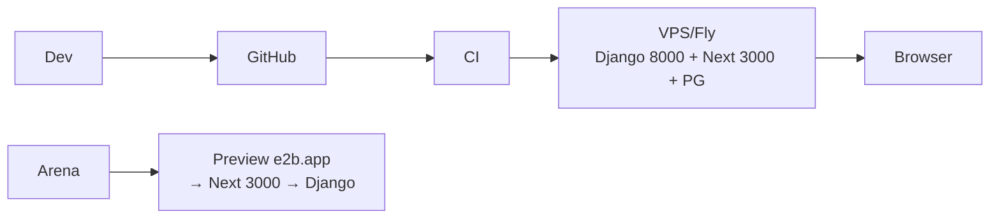

# pmo_epc2 — Cahier des Charges Technique (Django 5.1 + Next.js 15 / Postgres)

---

## 1. Stack

Python 3.11+, Django 5.1.8, `psycopg[binary]`, `django-filter/tables2/crispy/guardian/whitenoise`, Pillow, gunicorn — Next.js 15 (App Router), Tailwind 4, shadcn/ui, TanStack Query, Recharts, PostgreSQL 15+. Node 20, Python 3.11. Arena preview support.

## 2. Architecture

```
backend/ (Django)
  apps/{accounts,projects,contracts,tasks,documents,planning,planning_project,costs,risks,core_ref}
  core/settings.py (decouple, STORAGES WhiteNoise, LOGGING)
  services/*.py (Gantt, Charge, Jalons, Retards, EVM)
frontend/ (Next.js)
  app/(dashboard)/{projects,tasks,planning,planning-projet,documents}/
  components/ui/ + lib/api.ts (fetch /api)
```

Vues Django légères → Services Python → ORM. Frontend consomme `/api/v1`.

## 3. DB Postgres

Mêmes tables que pmo_epc1 mais types Postgres (`BIGINT IDENTITY`, `DECIMAL`, `CHECK`), CTE récursive WBS :

```sql
WITH RECURSIVE wbs AS (
  SELECT id, parent_id, 1 AS niveau FROM tasks_tache WHERE parent_id IS NULL
  UNION ALL SELECT t.id, t.parent_id, w.niveau+1 FROM tasks_tache t JOIN wbs w ON t.parent_id=w.id
) SELECT * FROM wbs WHERE niveau<=5;
```

Indexes `GIN` si JSONB KPI.

## 4. Preview Arena

- Django : `0.0.0.0:8000` (`ALLOWED_HOSTS` inclut `*.e2b.app`), `CORS_ALLOW_ALL` en dev
- Next : `0.0.0.0:3000` (`next dev -H 0.0.0.0`), `next.config.js` `async rewrites() { /api/:path* → http://localhost:8000/api/:path* }`
- Start : `process` `Website` → `npm --prefix frontend run dev` + `python backend/manage.py runserver 0.0.0.0:8000`

## 5. Auth

`accounts.User(email USERNAME_FIELD)`, `guardian` object perms, NextAuth/JWT via Django `/api/auth/login` → HttpOnly cookie.

## 6. GED Storage

`MEDIA_ROOT/documents/%Y/%m/`, `DocumentService` génère `code_documentaire`, S3 compatible en prod.

## 7. EVM & S-curve

`Projet.recalculer_progression()` → `aggregate(Sum(F('avancement')*F('poids'))/Sum('poids'))`, `ProjetCurvePoint` + `ForecastRule` (CPI/SPI/HYBRID), Recharts.

## 8. Qualité

`pytest` + `factory-boy`, `ruff/black`, `mypy`, GitHub Actions (lint, pytest, build next). `makemigrations` + `migrate`.

## 9. Déploiement

VPS OVH / PaaS : `docker-compose (web, db, next)`, `gunicorn`, `collectstatic`, `ALLOWED_HOSTS` prod, `SECRET_KEY` env.


