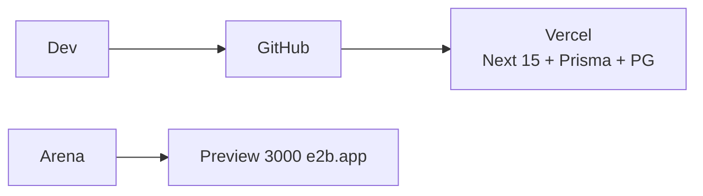

# pmo_epc3 — Cahier des Charges Technique (Next.js 15 / TypeScript / Prisma / Tailwind — Preview Arena)

---

## 1. Stack

Next.js 15 (App Router, Server Actions), TypeScript 5, Tailwind 4, shadcn/ui, TanStack Query/Table, Recharts, Prisma 6, SQLite (dev/preview) → Postgres (prod), NextAuth (email), Zod, Vitest. **Aucun PHP/Python** — `npm run dev` suffit.

## 2. Architecture

```
pmo_epc3/
  app/(dashboard)/{projects,commands,tasks,planning,planning-projet,documents,costs,risks,hse}/
  components/{ui, gantt, wbs, scurve, kpi}/
  lib/{prisma.ts, utils.ts}
  prisma/schema.prisma
  server/actions/{tasks.ts, documents.ts, evm.ts}
```

Server Actions → Prisma → SQLite/Postgres. Validation Zod (poids/avancement 0..100, niveau>=1).

## 3. Modèle Prisma (extrait)

```prisma
model Projet { id String @id @default(cuid()); code String @unique; phases Phase[]; commandes Commande[]; taches Tache[]; ... }
model Commande { id String @id; projetId String; phaseId String; codeCommande String @unique; codeOriginator String @db.Char(4); ... }
model Tache {
  id String @id; projetId String; commandeId String?
  parentId String?; parent Tache? @relation("WBS", fields:[parentId], references:[id]); enfants Tache[] @relation("WBS")
  niveau Int @default(1); poids Decimal; avancement Decimal; estJalon Boolean; ...
  liensSource TacheLien[] @relation("source"); liensCible TacheLien[] @relation("cible")
  documents TacheDocument[]
  @@check(poids >= 0 && poids <= 100); @@check(avancement >=0 && avancement<=100); @@index([projetId, niveau])
}
model TacheLien { tacheSourceId String; tacheCibleId String; typeLien String; decalage Int; @@id([tacheSourceId, tacheCibleId, typeLien]) }
model TacheDocument { tacheId String; documentId String; role String?; @@id([tacheId, documentId]) }
model Document { codeDoc String @unique; projetId String; commandeId String?; classeId String; statutId String; revisions Revision[] }
```

CTE WBS côté Prisma : `parent` récursif + `niveau` calculé en Server Action (ou SQL raw `WITH RECURSIVE`).

## 4. Preview Arena

```json
// package.json
"dev": "next dev -H 0.0.0.0 -p 3000"
```

- `next.config.ts` : aucun proxy (tout en Next)
- Arena : `start_process("npm --prefix pmo_epc3 run dev", name="pmo_epc3")` → preview `https://3000-{id}.e2b.app`
- Env : `DATABASE_URL="file:./dev.db"` (SQLite, zéro config)

## 5. Auth

NextAuth email + `role` enum (ADMIN/PMO/.../CONTRACTOR), middleware `conteneur.lecture_seule`.

## 6. GED & EVM

Upload `app/api/documents/upload` → `code_documentaire` auto `[PAYS]-[SITE]-[ORIG]-[DISC]-[TYPE]-[SEQ]`, Prisma `DocumentRevision`. EVM : Server Action `recalculer_progression()` via `aggregate`.

## 7. Qualité & Déploiement

ESLint, Prettier, Vitest, Playwright, GitHub Actions (build + prisma migrate). Déploiement : Vercel (SQLite→Neon/Supabase Postgres : changer `DATABASE_URL`).



Voir `docs/REFONTE_PMO_EPC_OVERVIEW.md` pour Mermaid métier.
